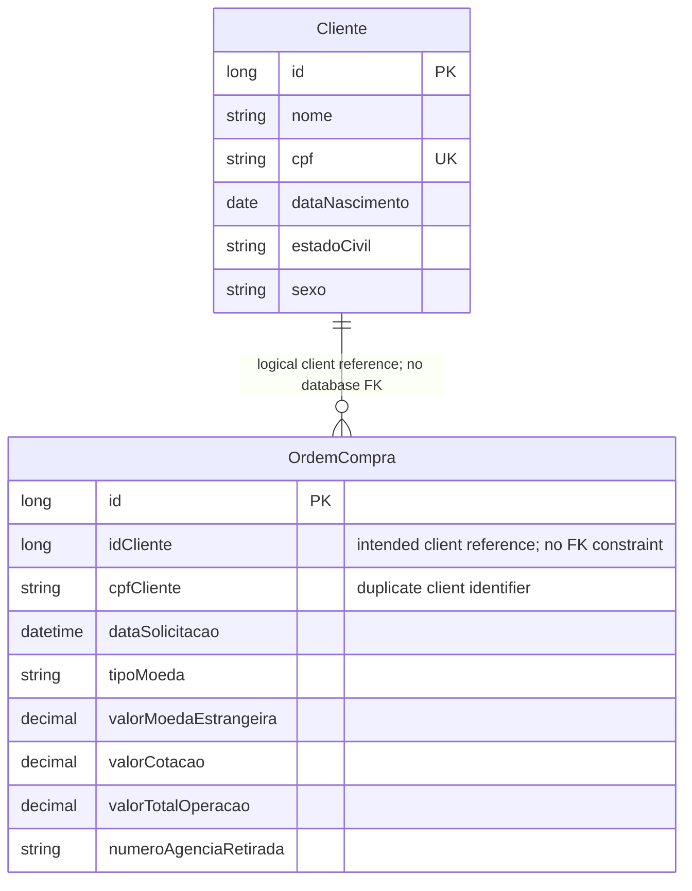

# Data Architecture & Persistence Layer

The application persists two foreign-exchange domain entities in a relational database using JPA. H2 is configured for local use, while Flyway owns schema creation and versioning.

## Database Configuration

| Service/Module | DB Type | Profile | Driver | Connection | Migration Tool |
|---|---|---|---|---|---|
| Application | H2 in-memory | Default configuration; no active profile-specific database configuration found | `org.h2.Driver` | `jdbc:h2:mem:transfer;DB_CLOSE_DELAY=-1` | Flyway, migrations in `src/main/resources/db/migration` |
| Application | PostgreSQL | Not configured as an active profile; only a commented connection example and runtime dependencies are present | `org.postgresql.Driver` dependency present; connection configuration is commented out | No active connection | Flyway PostgreSQL support dependency is present |

Flyway creates the schema before Hibernate validates entity mappings; Hibernate does not generate or update the schema. Migration history includes `clientes` and `compras` (`V5`, `V6`) as well as `accounts` and `transfers` (`V1`-`V4`). `V3` seeds account and transfer records, not foreign-exchange records. The account and transfer tables have no corresponding JPA entities in the inspected source.

## Data Ownership per Service

| Service | Tables Owned | ORM Framework | Caching | Notes |
|---|---|---|---|---|
| `cliente` module | `clientes` | Jakarta Persistence / Hibernate through Spring Data JPA | None found | CPF is unique in the database and used for lookup. |
| `compra` module | `compras` | Jakarta Persistence / Hibernate through Spring Data JPA | None found | Stores client ID and a second copy of the client's CPF; no database foreign key is defined. |
| Legacy transfer schema | `accounts`, `transfers` | No mapped JPA entities found | None found | Tables and seed data remain in migrations but are not represented by the current foreign-exchange entity model. |

## Entity Model

`Cliente` maps to `clientes` in [Cliente.java](../../../../../src/main/java/com/ada/caixa/transfer/cliente/domain/Cliente.java); its generated ID is the primary key, and CPF is unique. `OrdemCompra` maps to `compras` in [OrdemCompra.java](../../../../../src/main/java/com/ada/caixa/transfer/compra/domain/OrdemCompra.java). It stores `idCliente` and `cpfCliente` as scalar fields rather than a JPA association. The database schema does not declare a foreign-key constraint from `compras.id_cliente` to `clientes.id`.

The order's monetary columns use fixed-precision decimal types. `ClienteService` and `OrdemCompraService` use `@Transactional`; read operations are marked read-only. No bidirectional or unidirectional ORM relationship mapping was found.

The diagram shows the intended logical client-to-orders association only. It is not a database-enforced foreign key. `Cliente` is owned by the `cliente` module; `OrdemCompra` is owned by `compra`.

<!-- mermaid-checked: every attribute is `<type> <name> [<key>] ["<description>"]` with at most one of PK/FK/UK, no \n in descriptions, no {} in descriptions, every relationship label is double-quoted -->

## Key Repository Methods

| Service | Repository | Notable Methods | Purpose |
|---|---|---|---|
| `cliente` | `ClienteRepository` (`src/main/java/com/ada/caixa/transfer/cliente/repository/ClienteRepository.java`) | `boolean existsByCpf(String cpf)` | Check whether a CPF is already registered. |
| `cliente` | `ClienteRepository` | `Optional<Cliente> findByCpf(String cpf)` | Find one client by CPF. |
| `compra` | `OrdemCompraRepository` (`src/main/java/com/ada/caixa/transfer/compra/repository/OrdemCompraRepository.java`) | `List<OrdemCompra> findAllByCpfClienteOrderByDataSolicitacaoDesc(String cpfCliente)` | Retrieve a client's orders, newest first, using the copied CPF. |

Standard CRUD operations are inherited from `JpaRepository`. No custom SQL, named queries, or `@Query` methods were found.

## Caching Strategy

No application cache provider, Spring Cache annotations, JCache binding, or Hibernate second-level cache configuration was found. Repository reads use the database directly; no TTL, eviction policy, or cache-aside behavior is configured.

## Data Ownership Boundaries

This is a single application using a single configured database, with logical ownership divided between the `cliente` and `compra` packages. The current configuration uses H2 in memory; PostgreSQL dependencies and Flyway support are present, but the PostgreSQL connection is not active in a profile. There is no evidence of isolated databases, cross-service database access, or CQRS.

The purchase module calls the client service in-process and copies both the client's ID and CPF into each order. The ID is not protected by a foreign-key constraint, and no ORM association is mapped. If the CPF copy is intended as a historical snapshot, the specification should say so; otherwise, retaining only the client ID and resolving CPF through the client record would avoid duplicated PII. The repository's purchase history query currently filters by the copied CPF.

### Data Classification & Sensitivity

| Entity | Sensitive Fields | Classification (PII/PHI/PCI/None) | Controls in Place |
|---|---|---|---|
| `Cliente` | `nome`, `cpf`, `dataNascimento`, `estadoCivil`, `sexo` | PII | No field-level encryption or masking was found in the entity mappings or application configuration. |
| `OrdemCompra` | `cpfCliente` | PII | CPF is stored redundantly alongside the client ID; no field-level encryption or masking was found. |
| `OrdemCompra` | Currency, amounts, quote, request time, branch number | None of PII/PHI/PCI by themselves | No special data protection mechanism found for these fields. |
